# aws-examen-web-Andres-MartinezMartinez
## Examen AWS: Creación de una VPC con Máquinas Virtuales y Despliegue Web
### Paso 1: Crear una VPC en AWS
```bash
   - Crear una VPC llamada: mi-vpc-TuNombre-Apellidos.
   - CIDR Block: 10.0.0.0/16
``` 

```bash
   - Crea dos subredes:
        - subnet-linux: CIDR 10.0.1.0/24
        - subnet-windows: CIDR 10.0.2.0/24
``` 
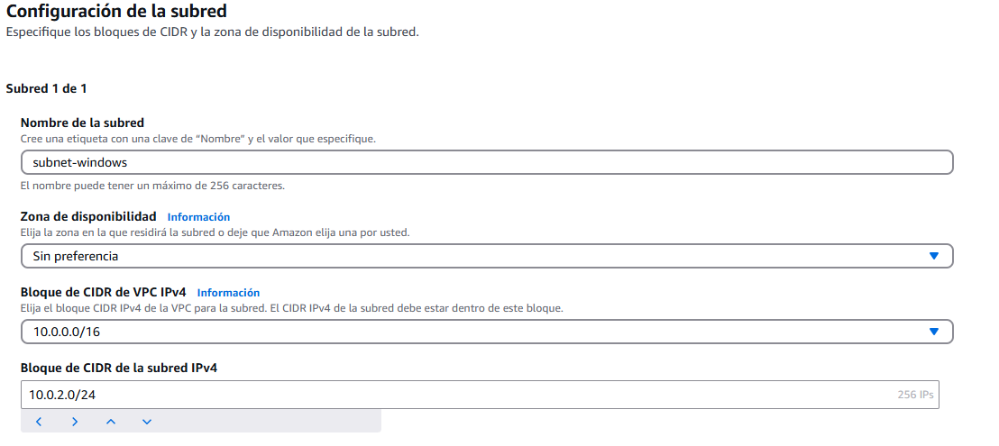

```bash
    - Crea una Internet Gateway asociada a la VPC
``` 


```bash
    - Añade una regla en la tabla de rutas (0.0.0.0/0) hacia el Internet Gateway
``` 


### Paso 2: Creación de instancias EC2
#### 1. Instancias EC2 Windows
```bash
    - Windows Server 2022 en la subnet-windows.
``` 


```bash
    - Tipo: t3.medium.
``` 
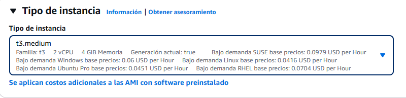
```bash
    - Crea las llaves.
``` 
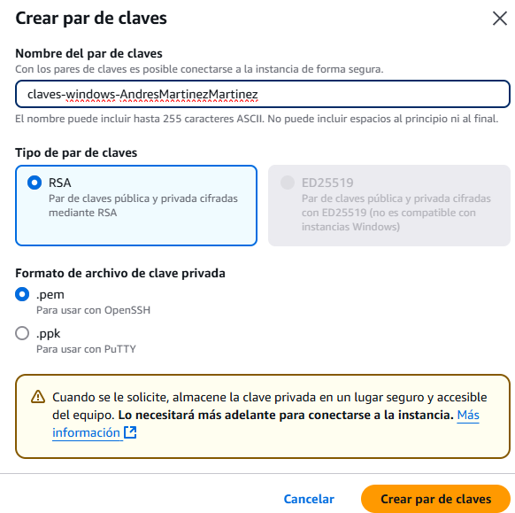
```bash
    - Security Group Entrante: HTTP (80), Vite (5173), RDP (3389).
``` 
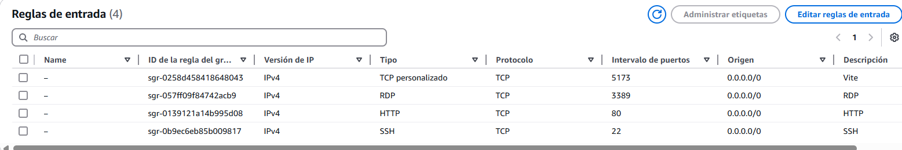

#### 2. Instancias EC2 Linux(Ubuntu)
```bash
    - Ubuntu 22.04 en la subnet-linux.
``` 
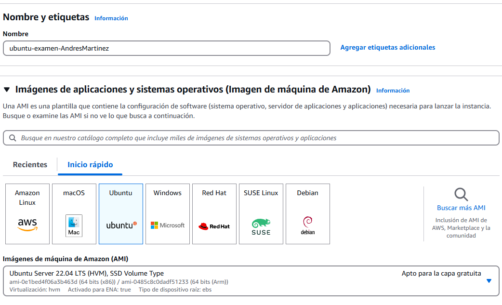
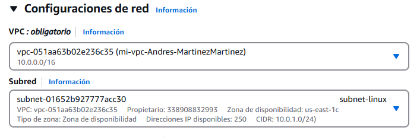
```bash
    - IP pública asignada.
``` 

```bash
    - Security Group Entrante: HTTP (80), Vite (5173), SSH (22)
``` 

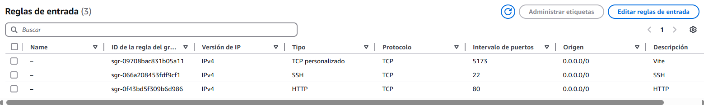
```bash
    - Acceso mediante clave privada SSH.
``` 
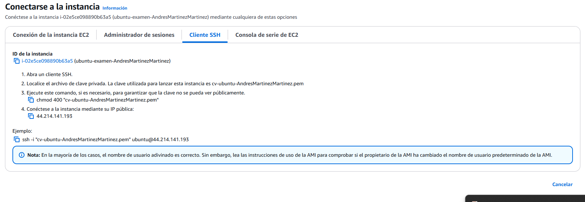
### Paso 3: Instalación y despliegue web
```bash
    - Linux (Ubuntu SSH)
``` 

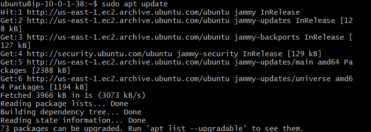
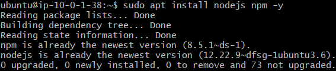


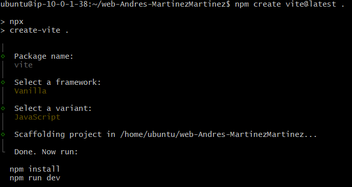


### Paso 4: Pull request


